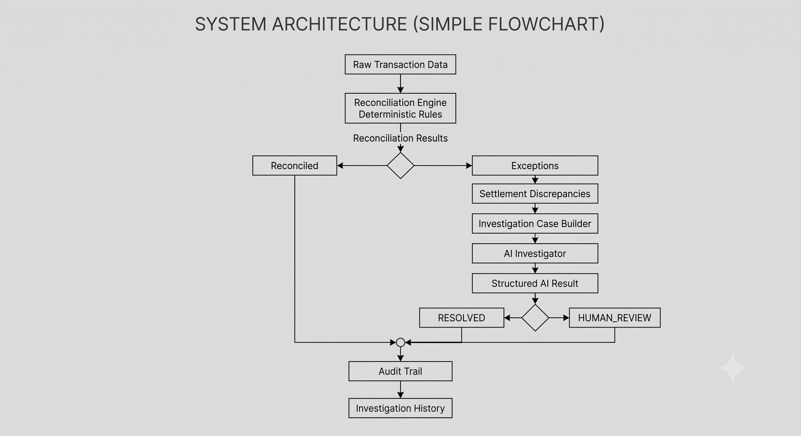

# AI Reconciliation Assistant

An AI-powered financial reconciliation and exception investigation system that combines deterministic transaction reconciliation with evidence-based AI investigation.

The system automatically identifies reconciliation exceptions and uses AI to investigate settlement discrepancies, determine whether they can be explained by available evidence, and escalate ambiguous or conflicting cases for human review.

### URL 
#### [AI-Reconciliation-Assistant](https://ai-reconciliation-assistant-act4xsbec7xxax3jcwvpyf.streamlit.app/)
---

## Problem

Financial reconciliation teams often deal with large volumes of transactions where payments, orders, fees, adjustments, and settlements need to match.

Traditional reconciliation systems can identify that:

> "The settlement amount does not match the expected amount."

But identifying the discrepancy is only the first step.

The difficult question is:

> "Why does this discrepancy exist, and can it be safely resolved?"

The AI Reconciliation Assistant addresses this investigation layer.

---

## Solution

The system uses a two-stage approach:

### 1. Deterministic Reconciliation

A rule-based reconciliation engine validates transactions and identifies financial exceptions.

It checks:

- Payment success
- Duplicate payments
- Payment amount mismatches
- Settlement existence
- Duplicate settlements
- Expected settlement amount
- Actual settlement amount
- Settlement discrepancies

### 2. AI Investigation

Settlement amount discrepancies are passed to an AI Investigator.

The AI:

- Examines the available financial evidence
- Explains the discrepancy
- Determines whether the evidence is sufficient
- Identifies conflicting or missing evidence
- Returns a structured investigation decision
- Assigns a confidence score
- Escalates uncertain cases to human review

The AI is strictly investigative and does not modify financial records or execute financial actions.

---

## Key Idea

The system deliberately separates:

**Detection** from **Investigation**.

```text
"What is wrong?"
        ↓
Deterministic Reconciliation Engine

"Why is it wrong?"
        ↓
AI Investigator

"Can this be safely resolved?"
        ↓
RESOLVED / HUMAN_REVIEW
```

# System Architecture



# AI Investigation Policy

The AI Investigator follows strict evidence-based rules.

### RESOLVED

A case is resolved only when the available evidence sufficiently explains the settlement discrepancy.

### HUMAN_REVIEW

#### A case is escalated when:

- Evidence is missing
- Evidence is insufficient
- Evidence is contradictory
- A settlement note is not independently supported
- The AI is uncertain about the explanation

### The AI must never invent:

- Adjustments
- Fees
- Refunds
- Transactions
- Financial explanations
- Missing evidence

The AI also does not modify financial amounts or approve financial actions.

#### Example
```text
Explainable Settlement Mismatch
Expected Settlement: ₹1,969.02
Actual Settlement:   ₹1,830.02
Difference:          ₹139.00

Settlement Note:
Manual deduction of INR 139.00 applied during settlement processing.

AI Decision:

RESOLVED

The documented manual deduction explains the exact settlement difference.
```
```text
Conflicting Settlement Evidence
Expected Settlement: ₹1,825.54
Actual Settlement:   ₹1,642.54
Difference:          ₹183.00

Settlement Note:
Manual deduction of INR 183.00 applied during settlement processing.

Recorded Adjustment:
₹0.00

AI Decision:

HUMAN_REVIEW
```

The settlement note mentions a deduction, but the available financial records do not independently support it.

The AI therefore does not assume that the note is correct.

# Current Dataset

The included demonstration dataset contains 1,000 transactions covering normal transactions and multiple reconciliation exception scenarios.

The dataset includes scenarios such as:

- Normal transactions
- Processing fees
- Explainable settlement mismatches
- Delayed settlements
- Missing settlements
- Payment amount mismatches
- Unexplainable settlement mismatches
- Duplicate payments
- Failed payments
- Conflicting settlement evidence
- Duplicate settlements

## Reconciliation Results

The deterministic reconciliation engine identifies:

| Result             | Count |
| ------------------ | ----: |
| Total Transactions | 1,000 |
| Reconciled         |   660 |
| Exceptions         |   340 |

### Exception breakdown:
| Exception Type             | Count |
| -------------------------- | ----: |
| Settlement Amount Mismatch |   150 |
| Settlement Missing         |    60 |
| Payment Amount Mismatch    |    50 |
| Duplicate Payment          |    40 |
| Payment Not Successful     |    30 |
| Duplicate Settlement       |    10 |


## Audit Trail

Every successful AI investigation is recorded in an audit trail.

The audit record contains:

- Timestamp
- Order ID
- Exception type
- AI decision
- Investigation reason
- Supporting evidence
- Confidence
- Execution status

The audit data is stored locally at runtime in:
```data/audit/ai_investigations.csv```

Runtime audit data is excluded from version control.

The Streamlit dashboard also provides an Investigation History section for reviewing previous AI investigations.

# Project Structure
```text
AI-Reconciliation-Assistant/
│
├── app/
│   └── app.py
│
├── data/
│   ├── raw/
│   │   └── reconciliation_data.csv
│   ├── processed/
│   └── audit/
│
├── src/
│   ├── __init__.py
│   ├── exception.py
│   ├── logger.py
│   ├── generate_data.py
│   ├── reconciliation_engine.py
│   ├── ai_investigator.py
│   ├── reconciliation_service.py
│   ├── audit_trail.py
│   ├── batch_investigator.py
│   ├── evaluate_ai.py
│   ├── run_ai_investigator.py
│   └── run_batch_investigator.py
│
├── tests/
│   ├── conftest.py
│   └── test_ai_investigator.py
│
├── .gitignore
├── requirements.txt
└── README.md
```

# Technology Stack
## Backend
- Python
- Pandas
- Pydantic
## AI
- Google Gemini API
- Structured JSON output
- Evidence-based investigation
## Frontend
- Streamlit
## Testing
- Pytest
## Data
- CSV-based transaction dataset

## How to Run

### 1. Clone the repository

```bash
git clone <https://github.com/Animessshh/AI-Reconciliation-Assistant>
cd AI-Reconciliation-Assistant
```

### 2. Create the environment

Using Conda:

```bash
conda create -n ai-recon python=3.12
conda activate ai-recon
```

### 3. Install dependencies

```bash
pip install -r requirements.txt
```

### 4. Configure the Gemini API key

Create a `.env` file in the project root:

```
GEMINI_API_KEY=your_api_key_here
```

> **Note:** Do not commit the `.env` file.

### 5. Run the Streamlit application

From the project root:

```bash
python -m streamlit run app/app.py
```

The application will open in your browser.

---

## Using the Application

**Step 1**
The dashboard runs the reconciliation engine and displays:

- Total transactions
- Reconciled transactions
- Exceptions
- AI-investigable cases

**Step 2**
Review the exception breakdown and exception cases.

**Step 3**
Select a settlement discrepancy.

**Step 4**
Review the financial summary.

**Step 5**
Click:

```
Investigate with AI
```

The AI investigates only the selected case.

**Step 6**
Review:

- Investigation decision
- Investigation summary
- AI confidence
- Supporting evidence
- Recommended action

**Step 7**
Review previous investigations in:

```
Investigation History
```

---

## AI Usage Design

AI investigations are performed on demand rather than automatically for every exception.

This design:

- Reduces unnecessary AI usage
- Avoids sending irrelevant exceptions to the LLM
- Reduces API consumption
- Keeps deterministic validation independent of the AI
- Allows human operators to control when an investigation is performed

---

## Testing

Run the automated test suite:

```bash
python -m pytest -v
```

Current result:

```
17/17 tests passed
```

The AI Investigator was also evaluated against representative cases covering:

- Explainable settlement mismatches
- Unexplainable settlement mismatches
- Conflicting settlement evidence

Evaluation result:

```
Total cases:       9
Passed:            9
Failed:            0
Decision accuracy: 100%
```

The evaluation measures agreement with the expected investigation decision across the selected representative cases.

---

## Reliability and Error Handling

The AI integration includes handling for common API failures.

The application gracefully handles:

- Rate limits
- Quota exhaustion
- API timeouts
- Empty AI responses
- Unexpected AI service errors

Raw provider errors are not exposed directly to the user.

---

## Safety and Financial Controls

The AI Investigator is intentionally designed as a **read-only investigation system**.

It does not:

- Modify transaction amounts
- Modify settlements
- Create refunds
- Approve payouts
- Approve deductions
- Execute financial transactions
- Automatically resolve unsupported discrepancies

Financial decisions requiring insufficient or conflicting evidence are escalated to human review.

---

## Future Improvements

Potential future extensions include:

- Database-backed audit storage
- Role-based access control
- Richer investigation history
- Human reviewer workflows
- Additional reconciliation rules
- Investigation analytics
- Batch AI evaluation pipelines
- Integration with payment and settlement APIs
- Production-grade observability
- Automated evidence retrieval from financial systems

---

## Project Goal

The goal of the AI Reconciliation Assistant is not to replace deterministic financial reconciliation.

Instead, it adds an intelligent investigation layer on top of reconciliation:

```
Detect → Investigate → Explain → Resolve or Escalate
```

This allows financial operations teams to focus their attention on the exceptions that actually require human judgment.
